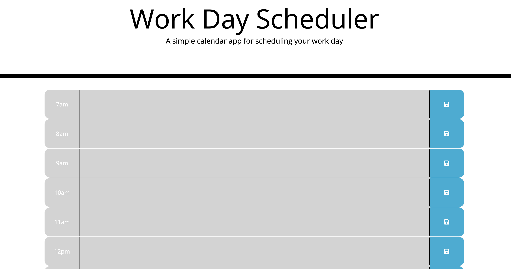
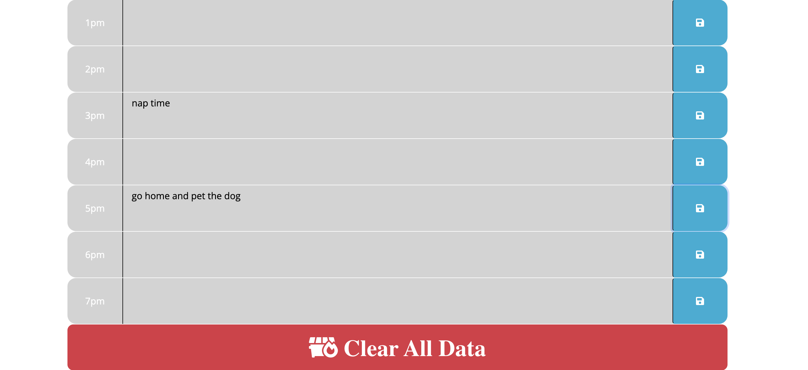

# Work Day Scheduler
### Challenge 5

## Live Deployment Link
[Work Day Scheduler](https://vincenttoon.github.io/daily-scheduler/)

## Instructions for Challenge

Use jQuery and Bootstrap to help given starter code more functional. Along with styling from Bootstrap, the page must have columns for each hour that allows you to save data for your daily work schedule. When you reload the page, your previous entries reappear. 

## Deployment Team

[Vincent Toon](https://github.com/Vincenttoon)

## User Story
- AS AN employee with a busy schedule
- I WANT to add important events to a daily planner
- SO THAT I can manage my time effectively

### Acceptance Criteria

- GIVEN I am using a daily planner to create a schedule
- WHEN I open the planner
- THEN the current day is displayed at the top of the calendar
- WHEN I scroll down
- THEN I am presented with time blocks for standard business hours
- WHEN I view the time blocks for that day
- THEN each time block is color-coded to indicate whether it is in the past, present, or future
- WHEN I click into a time block
- THEN I can enter an event
- WHEN I click the save button for that time block
- THEN the text for that event is saved in local storage
- WHEN I refresh the page
- THEN the saved events persist

## Notes
- Might go back and create loop's for divs, and button actions so code is less repetitive
- Local storage gave me the fits again, but I think I figured it out. 
- Would like page to refresh on clear data